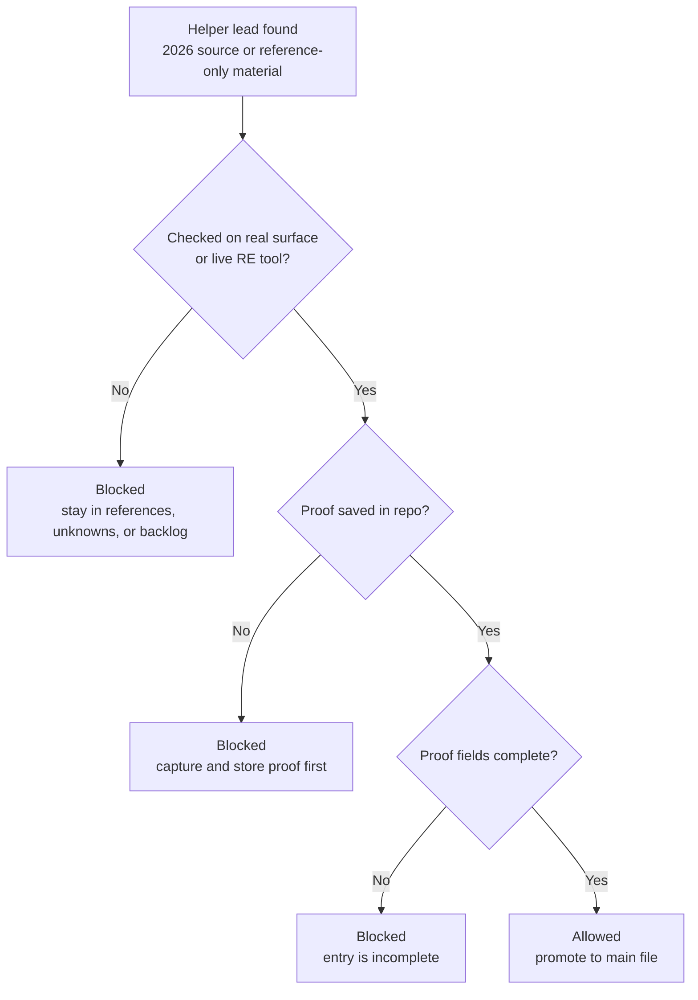

# Source Proof Gate Cleanup Design

## Problem

The repository still carries old training-data behavior in two harmful ways:

1. Future sessions can still be told to seed work from training data.
2. Some main project files still contain training-data-seeded framing and labels.

This creates the wrong behavior: helper material can be mistaken for proof.

The user wants a strict cleanup:

- only current 2026 sources may be used as helper material
- helper material is never source-of-truth
- nothing enters main files until it is confirmed by the real surface itself or by a live reverse-engineering tool
- the dropped UE4SS dev edition is useful context, but must live in a clearly marked reference-only area

The UE4SS dev edition is a narrow user-supplied exception:

- it is allowed as reference-only guidance
- it is not treated as a verified source
- it does not weaken the proof gate

One narrow exception must be handled explicitly:

- the dropped UE4SS dev edition is an allowed **user-supplied reference artifact**
- it may guide the search
- it is not proof
- it does not change the rule that main files require direct confirmation

## Goal

Make the repository follow one simple rule:

**Helper material may guide the search. Only directly proven facts may enter main files.**

## Reverse-Engineering Method Order

Future work should follow the user's layered enumeration method in hard order:

1. Layer 1 — use what is already documented
2. Layer 2 — use the live game UI as a checklist
3. Layer 3 — static analysis
4. Layer 4 — dynamic analysis
5. Layer 5 — behavioral observation

This is not just a preference. It is the required work order unless a repository rule explicitly documents a blocker exception.

## Organization Rule

Discoveries must be organized by **game system**, not by tool.

Example:

- inventory findings from Cheat Engine, UE4SS, Ghidra, x64dbg, and live observation all belong under the inventory system
- the tool used is recorded in proof and source metadata, not used as the main filing structure

## Scope

This design covers:

- rewriting the original scaffolding prompt so it no longer teaches training-data seeding
- cleaning up instruction and survey files that still normalize training-data carryover
- introducing a hard proof gate in the files future sessions read first
- separating helper/reference-only material from proof-backed project files
- moving the dropped UE4SS dev edition into a clearer reference-only home
- auditing other proof-backed main folders only if they currently contain source-policy wording or unproven claims

This design does **not** cover:

- performing new reverse-engineering work
- extracting facts from the UE4SS reference tree into canonical files
- API design
- rewriting proof-backed folders that are unaffected by the bad source-policy wording

## Core Rule

The repository will enforce this order:

1. A lead is found from a helper source or reference-only material.
2. The lead is checked on the real surface or with a live reverse-engineering tool.
3. The proof is saved in the repository.
4. Only then may the fact be promoted into a main file.

If any step is missing, promotion stops.

In plain language:

**No proof record, no main-file entry.**

## Gate Illustration



The picture shows the same rule as the written policy:

- helper material may start the search
- proof must be captured before promotion
- if a gate is not satisfied, the item stops and stays out of main files

## Repository Lanes

The repo will be treated as three separate lanes:

| Lane | What belongs there | What does not belong there |
|------|--------------------|----------------------------|
| Main files | Directly proven facts | Guesses, copied helper claims, unverified summaries |
| Helper / reference-only | 2026 sources, dropped reference code, current guides that help point the search | Anything presented as confirmed project truth |
| Unknowns / backlog | Short reminders of what still needs checking | Imported claims treated as if they are already true |

For this cleanup, **main files** means the files and folders future sessions can read as project truth:

- `CLAUDE.md`
- `RULES.md`
- `NEXT_SESSION.md`
- `workflow/`
- `survey/`
- `systems/`
- `surfaces/`
- `memory/`
- `hooks/confirmed/`
- `relationships/`
- canonical proof-backed `findings/` content, excluding `findings/pre-migration/`

It does **not** mean:

- `references/`
- `evidence/` helper-source indexes
- `unknowns/`
- `backlog/`
- `intake/`
- `findings/pre-migration/`
- `hooks/candidates/`
- any other candidate-only tracking area

These non-proof lanes may still hold `inferred` or `speculated` lead material.
The proof-backed main lane may not.

## What Counts As Proof

For this project, proof means one of the following:

1. Direct confirmation from a live reverse-engineering tool session.
2. Direct confirmation from the real public-facing surface itself when the surface is the thing being mapped.

Examples:

- Cheat Engine, Ghidra, x64dbg, FModel, UHT dump, and current UE4SS runtime output can produce proof.
- Official docs, community docs, wiki pages, and the dropped UE4SS dev tree can point the search in the right direction, but do not satisfy the proof gate by themselves.

For public-facing surfaces, "the real surface itself" means the current live thing being inspected, for example:

- the actual current Steam Workshop page for Workshop support
- the actual current server config file for config settings
- the live REST API surface or its current official endpoint documentation when the REST surface itself is what is being mapped

These can prove that the public-facing surface exists and behaves a certain way.
They still do **not** prove internal game structures, memory layouts, or hook paths.

Official docs count as proof only when the public-facing surface itself is what is being mapped.
They do not count as proof for internal reverse-engineering facts.

## Where Proof Lives

To keep the gate checkable, promoted facts need one predictable proof-home rule:

1. Raw bulk tool output may still land in `intake/raw/` and `intake/processed/`.
2. But every fact promoted into a main file must also point to a short proof record stored under **`evidence/proof/`**.
3. That proof record is the stable thing the main file cites, even when the deeper raw artifact lives elsewhere.

This gives planning one clear rule:

**promoted entry -> proof record in `evidence/proof/` -> optional deeper raw artifact in `intake/`**

### Proof record contract

To keep the proof gate concrete, proof records should use one record per promoted fact.

Planned path shape:

`evidence/proof/YYYY-MM-DD/<fact-slug>.md`

Each proof record should capture:

- fact name
- fact confirmed
- proved by
- verified on
- game version
- raw artifact path if one exists
- short verification note

Survey proof notes and canonical finding proof fields should both point to this same proof record.

This proof record does not replace finding proof metadata.
It is the shared backing record both survey notes and canonical finding fields point to.

Planned proof record format:

```markdown
# <fact name>

- Fact confirmed: <single proven fact only>
- Proved by: <tool or real public-facing surface>
- Verified on: YYYY-MM-DD
- Game version: <version checked>
- Raw artifact: <path or 'none'>
- Verification note: <short plain-language explanation>
```

One proof record proves one fact. It must not bundle several separate claims into one record.

## Files To Change

### 1. `Project-PreReverseEngineering.md`

Rewrite Phase 0 so it no longer tells future sessions to survey from training data.

Replace that behavior with:

- use only current 2026 helper sources
- treat helper sources as search guidance only
- require direct proof before promoting anything into main files
- require the layered enumeration order

### 2. `CLAUDE.md`

Replace the current training-data warning section with a stricter source policy:

- training data is not an allowed source
- 2026 sources are helper material only
- reference-only material is not proof
- main files require direct confirmation
- official docs may prove a public-facing surface only when that surface itself is what is being mapped
- the dropped UE4SS dev tree is allowed as reference-only guidance only

Also add the proof gate to the files future sessions read first.

### 3. `RULES.md`

Add an explicit promotion gate so future sessions cannot move a lead into main files before proof is captured.

This should mirror the superpowers style:

- ordered steps
- a visible completion gate
- blocked-until language
- the public-surface-docs exception
- the UE4SS reference-only exception
- the layered enumeration order
- the organize-by-system rule

### 4. `workflow/PIPELINE.md`

Add an explicit gate between:

- lead / helper-guided discovery
- proof capture
- main-file promotion

The workflow should show that promotion is blocked until proof is captured and stored.
It should also show the required layer order before live tool work starts.

### 5. `NEXT_SESSION.md`

Add a short startup reminder that helper sources can generate leads, but promotion into main files is blocked until proof is captured.

Also include the same two exceptions in short form:

- public-surface docs may prove the public surface itself
- the dropped UE4SS tree is reference-only guidance only
- work proceeds in layered-enumeration order

### 6. `schemas/FINDING_SCHEMA.md`

Update the schema boundary so it is clear that `FINDING_SCHEMA.md` is for **canonical proof-backed findings**, not for every kind of lead or question in the repo.

Lead tracking in `unknowns/`, `backlog/`, `references/`, `hooks/candidates/`, and `findings/pre-migration/` does not need to be modeled as canonical findings.

Then update the design of canonical findings so proof is required, not optional.

At minimum, the schema changes planned from this spec must require:

- what produced the proof
- where the proof is stored
- when it was verified
- what exact fact was confirmed

Also resolve current confidence handling:

- canonical proof-backed findings use `confirmed`
- lead-tracking material outside the canonical finding lane may still use looser language, but it is not treated as a canonical finding

Existing canonical entries that currently sit in the main lane only because of old training-data seeding are in scope for this cleanup.
They must be removed from the canonical lane or moved into a non-canonical lead-tracking lane until proof exists.

### 7. `survey/SURFACES.md`

Remove training-data-seeded framing and wording.

Keep only entries and claims that are already directly supportable under the new rule.

Anything that existed only because of old training-data carryover is removed from the survey file instead of being kept with a warning tag.

If a survey entry mixes proven and unproven content:

- keep only the directly proven portion in the survey file
- remove the unsupported portion from the main file
- if the unsupported part is still worth checking later, turn it into a short question in `unknowns/` or `backlog/` rather than leaving it embedded in the survey text

Each retained survey entry should carry a proof note so the basis is visible.
If one topic contains several separately provable facts, split it into smaller proven pieces so each kept fact points to exactly one proof record.

### 8. `survey/GAME_SYSTEMS.md`

Apply the same cleanup as `SURFACES.md`.

This file must stop presenting old seeded structure as if it belongs in the main map before direct confirmation.

Mixed entries follow the same rule:

- proven parts stay
- unsupported parts leave the main file
- unresolved follow-up work becomes a separate question, not an inline claim

Each retained system entry should also carry a proof note.
If one topic contains several separately provable facts, split it into smaller proven pieces so each kept fact points to exactly one proof record.

### 9. `evidence/sources-2026.md`

Rewrite usage notes so this file is clearly a helper map:

- it shows where to look
- it does not prove internal facts by itself
- it does not bypass the proof gate

### 10. New reference-only area

Add a clearly named top-level `references/` area.

Move the dropped UE4SS dev edition from `unknowns/UE4SSforCONTEXTonly` into that area under an obviously reference-only name.

Add a short README that says:

- this material is guidance only
- it may help when progress is slow or a session is stuck
- nothing from it may enter main files without direct tool verification

Define the boundary clearly:

- `references/` holds large helper artifacts such as dropped code trees, SDKs, or guides kept for direction only
- `evidence/` holds source records and proof references used to support claims
- `unknowns/` holds open questions, not large helper drops
- `findings/pre-migration/` remains the legacy project data awaiting re-check, not a general helper-material bucket
- `backlog/` holds planned follow-up work items

Still-useful but unproven material should go to:

- `unknowns/` when it is an open question
- `backlog/` when it is a confirmed future task
- `references/` only when it is a large read-only helper artifact

`references/` is not part of startup reading and should not become a catch-all folder.

Also update any repo structure summary that lists top-level folders so `references/` is described everywhere it needs to be.

At minimum, this includes:

- `CLAUDE.md`
- `RULES.md`

## Cleanup Scope Boundary

This cleanup is **not** a full content rewrite of every proof-backed folder.

The required audit scope is:

1. all startup and instruction files that teach future sessions how to behave
2. all files already known to carry the bad source-policy wording
3. any proof-backed main file that still presents an unproven claim because of the old training-data seeding

If a proof-backed area contains only placeholders or unaffected README structure, it does not need to be rewritten just because it is part of the main lane.

## Superpowers-Style Guardrails

The user specifically wants the gate to behave like a superpowers workflow gate: one step cannot be done until the earlier condition is satisfied.

To mirror that style, the cleanup will add:

1. **Visible gate blocks** in the workflow and rules files.
2. **Ordered promotion steps** that make later steps explicitly blocked until proof exists.
3. **Required proof checks** stated in simple yes/no form.
4. **Failure language** that tells future sessions exactly what to do when the gate is not satisfied.

Example guardrail language:

> PROMOTION GATE — do not move this into a main file until proof is captured and saved.

Example layer language:

> LAYER GATE — do not begin Layer 3 until Layer 1 and Layer 2 have been exhausted for the current target.

## Data-Shape Guardrail

Main findings must require proof-bearing fields rather than free-floating claims.

The smallest required proof fields for proof-backed canonical entries should be:

- `proof.produced_by` — the tool or real surface that proved the fact
- `proof.location` — where the saved proof lives in the repo
- `proof.verified_on` — when the fact was checked
- `proof.fact_confirmed` — the exact claim that was proven

This is necessary because wording alone is not enough. If proof is not part of the required shape, people can still write success-shaped entries with no real backing.

For planning purposes, `proof.location` should point to a record under `evidence/proof/`.

## Validation Guardrail

The cleanup must include a repeatable validation pass before completion is claimed.

The validation method for this project should be a fixed repo check with pass/fail results.

At minimum, it must catch:

- old banned wording that still remains in instruction or main files
- main-file claims that do not carry the required proof form
- reference-only material left in the wrong lane

The planned pass/fail checks should include:

1. a banned-phrase sweep over startup and main files
2. a gate-presence sweep that confirms the promotion gate appears in the required startup files
3. a proof-form check for proof-backed entries in the cleaned survey and schema-driven files

The validation method will be a fixed command set with pass/fail output.

Planned checks:

1. banned-phrase sweep over startup and proof-backed main files
2. gate-presence sweep over startup files and workflow files
3. proof-record sweep over cleaned survey files

Planned validation scope:

- startup files: `CLAUDE.md`, `RULES.md`, `NEXT_SESSION.md`
- workflow files: `workflow/PIPELINE.md`
- survey files: `survey/SURFACES.md`, `survey/GAME_SYSTEMS.md`

Planned command set:

1. banned wording sweep
   - `rg "training data|UNVERIFIED - training data|UNVERIFIED — training data|may be outdated|seeded from AI training data" CLAUDE.md RULES.md NEXT_SESSION.md workflow survey`
2. gate presence sweep
   - `rg "PROMOTION GATE|LAYER GATE|layered enumeration|game system, not by tool" CLAUDE.md RULES.md NEXT_SESSION.md workflow`
3. proof record sweep
   - `rg "Proof source:|Proof record:|Verified on:" survey`

The implementation plan may refine the exact command syntax, but the validation stays command-based rather than vague manual review.

Planned banned phrases include:

- `training data`
- `UNVERIFIED — training data`
- `UNVERIFIED - training data`
- `may be outdated`
- `seeded from AI training data`

## Survey Proof Note Format

To make the survey cleanup checkable, each retained survey entry should use the same small proof note format:

```text
Proof source: <tool or real surface>
Proof record: evidence/proof/<path>
Verified on: YYYY-MM-DD
```

If an entry cannot carry this proof note, it does not stay in the survey file.
If a topic needs several proof notes, split it into several smaller proven pieces instead of stacking many notes into one block.

## Success Criteria

The cleanup is successful when all of the following are true:

1. No instruction file tells future sessions to use training data.
2. No main file keeps claims just because they were once tagged as training-data guesses.
3. 2026 sources are clearly described as helper material only.
4. Reference-only material is physically separated from proof-backed project files.
5. The workflow shows a visible promotion gate that blocks advancement until proof is captured.
6. `NEXT_SESSION.md` reinforces the gate instead of bypassing it.
7. The repo explicitly requires layered enumeration in order.
8. The repo explicitly requires organizing by game system, not by tool.
9. Future sessions reading the repo cold will see the right rule before they touch main files.

## Risks And Responses

| Risk | Why it matters | Response |
|------|----------------|----------|
| Over-cleaning removes useful direction | The repo could lose search leads | Keep helper material in `references/` and short action reminders in backlog or unknowns |
| Wording-only cleanup is ignored later | Future sessions may drift again | Put the gate in the startup files, workflow, and validation step |
| Reference-only code gets mistaken for proof | Future sessions may copy from it directly | Move it into a clearly named area with a hard warning README |
| Survey files become too empty | The project may feel less complete | Accept this temporarily; empty is safer than false certainty |

## Planning Notes

The implementation plan should treat this as one cleanup project with four work units:

1. Rewrite source-policy instructions.
2. Clean the main survey files.
3. Create the reference-only area and move the UE4SS drop.
4. Add proof-gate and layer-gate wording plus repeatable validation.
